# Part 1

### Data Visualisation

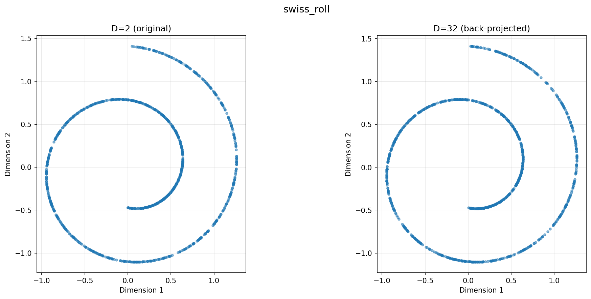
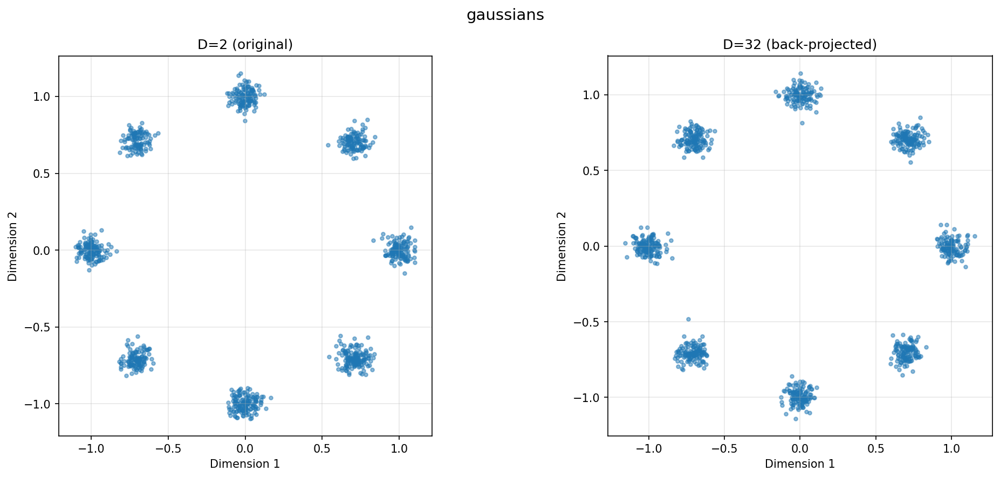
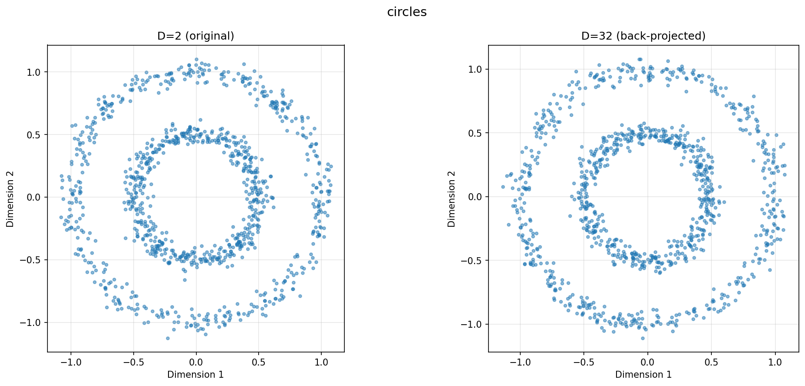

### v-Prediction Flow Matching at `D = 2`

Hyperparameters:

| n_steps | lr | batch_size | denoising_steps | generated_points | clamping |
| - | - | - | - | - | - |
| 25000 | 1e-3 | 1024 | 50 | 2048 | 0.01 |

Trained on $v$-prediction (target) with $v$-loss

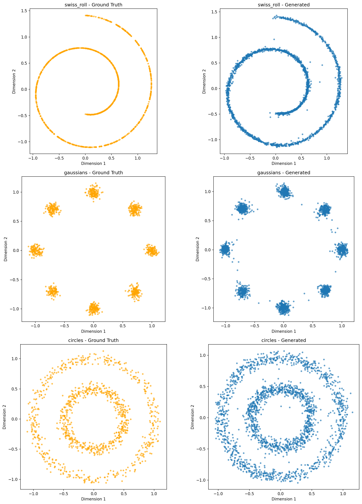

# Part 2

### Calculate flow matching based on $x$ or $v$-pred

We know (1) $z_t = (1-t)x + t\epsilon$. Further it is also defined that (2) $v = \epsilon - x$.

Rearranging (2) we get $\epsilon = v + x$, substituing this back into (1),

$$
z_t = (1-t)x + t(v + x) 
$$

$$
z_t = x - tx + tv + tx
$$

$$
z_t = x + tv \Rightarrow \boxed{x = z_t - tv} \Rightarrow \boxed{v = \frac{z_t - x}{t}}
$$

Hence in the scenario we predict $x$ with a loss in $v$, we can use the above equation to determine:

$$
v_\text{output} = \frac{z_t - x_\text{pred}}{t} \quad\quad\quad\quad v_\text{target} = \epsilon - x
$$

Similarly, for predicting $v$ with a loss in $x$, we have:

$$
x_\text{output} = z_t - t v_\text{pred} \quad\quad\quad\quad x_\text{target} = x
$$

### Reproduce papers findings

We use the same hyperparameters as Part 1.2.

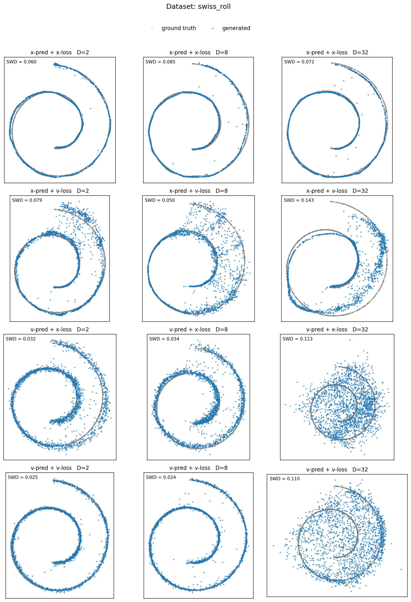
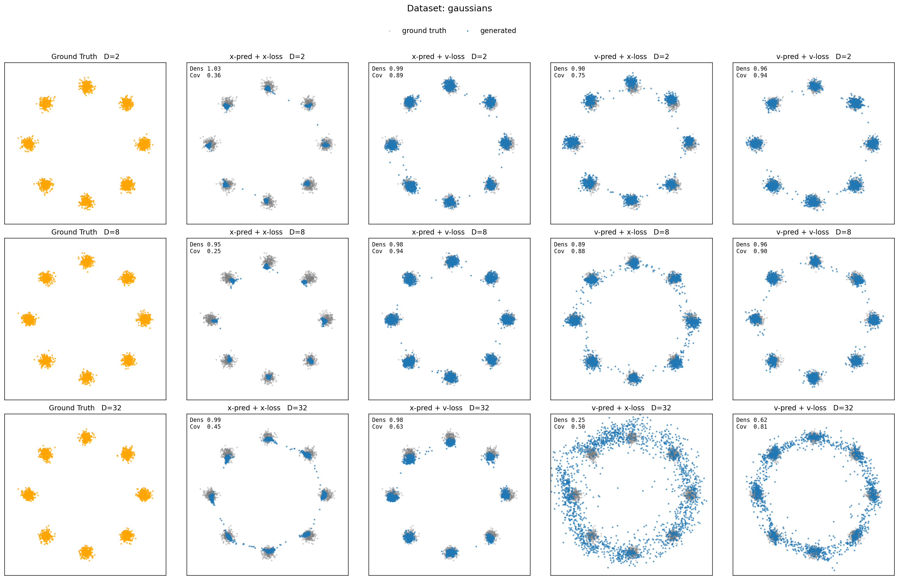
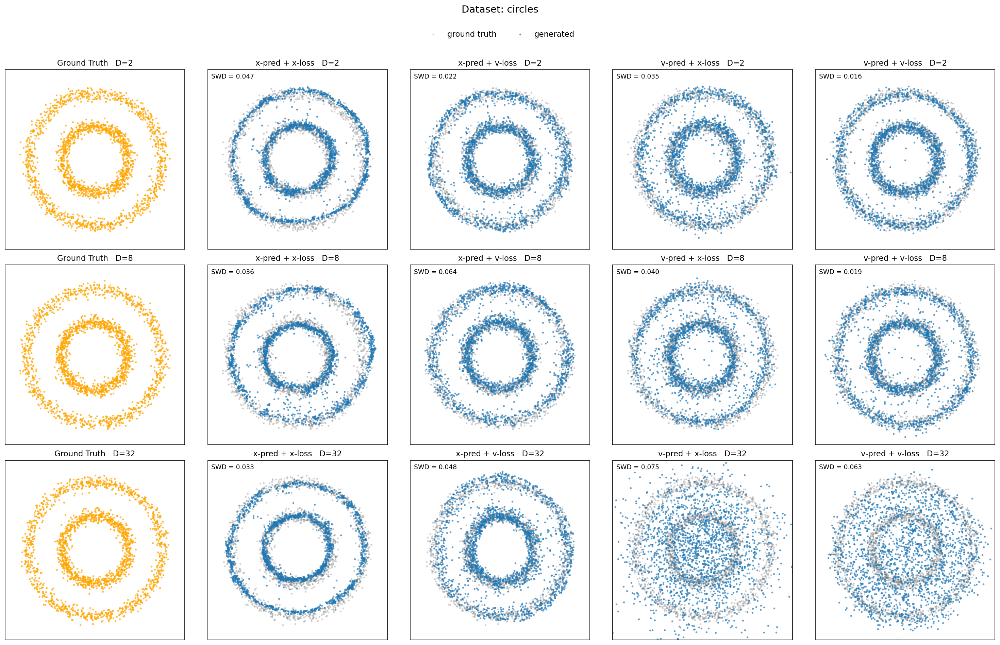

### Questions

#### 1. Prediction-type scaling

It is clear that $x$-prediction scales to $D=32$ better than $v$-prediction, across the three  datasets. Qualitatively $D=32$ with $x$-pred least resembles the target dataset. To make our analysis more robust, we measure generation density & coverage [1], a strong metric for comparing generation with ground truth. 

> **Density** is average number of real-point k-NN balls each generated sample falls into, divided by k [1]

> **Coverage** is fraction of real points whose k-NN ball contains at least one generated sample (k=5, ball radius = distance to k-th real neighbour). [1]

Below we plot density/coverage as a function of the ambient dimention $D$: 

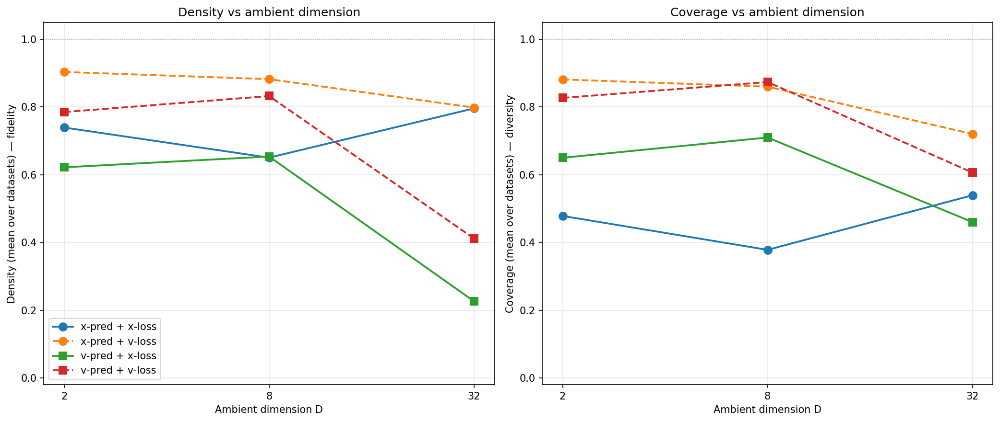

The trend is clear, $v$-pred (green and red) scales the worse than $x$-pred (blue and orange). This is consistent with our generated results.

$$x_\text{pred} >_\text{dim scaling} v_\text{pred}$$

#### 2. Loss-space
The impact of loss space appears to depend on the prediction type. When inspecting the density/converage graph above, the $v$-pred appears to follow the exact same trend, with a slight offset. $x$-pred on the other hand displays similar scaling (over $D$) across the loss types, but the offset is signficant, with the blue (x-loss) being much lower than the orange (v-loss).

These observations are convincingly backed by the following normalised loss plot (where loss is scaled by starting value):

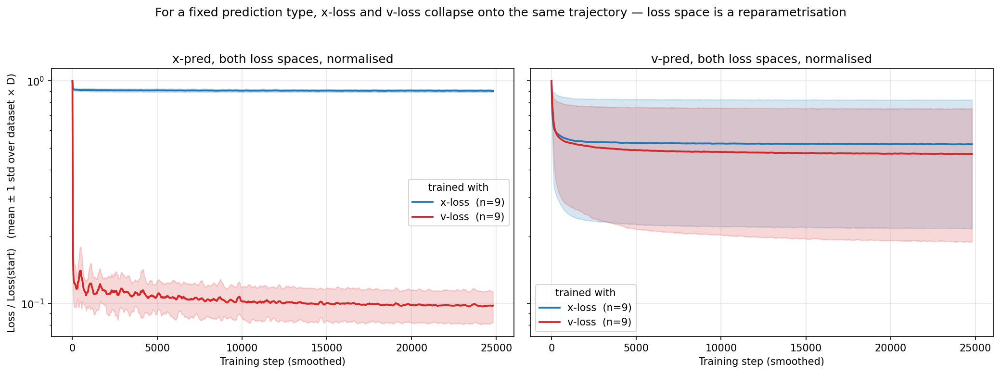

The plots demonstrate that loss has minor impact on convergence for $v$-pred, while $v$-loss is significantly stronger for $x$-pred.

This being said, when observing the density/coverage figure, the dominating factor behind performance is certainly the prediction type, with loss having a minor impact in the $x$-pred scenario.

#### 3. Why does $x$-pred scale to higher $D$
$x$-prediction scales superior to $v$-prediction as $D$ grows, as the signal to be learned is better preserved. For $x$-pred at a high $D$, the target data lies on a 2D manifold under $R^D$ (well described in [Basics](papers/Basics.pdf)). Therefore the model is intrinsically learning in 2D, regardless of $D$, i.e., a projection onto the manifold. I.e., $rank(x)_\text{intrinsic} = 2$.

Meanwhile, for $v$-prediction, the model is tasked with learning $v=\epsilon-x$. Unlike $x$, $\epsilon$ is full-rank Guassian noise in $R^D$ (i.e., intrinsic dim = $D$). This implies $v$ measurments are dominated by $\epsilon$, meaning $\uparrow D$ results in linearly increased complexity in $v$, while $x$'s complexity remains at 2. From inductive bias, it follows that the model will struggle to fit the taret. 

As for the loss-space, the MSE is a $t$-dependent reweighting, meaning the underlying objective being learned remains the same.

# Part 3: Can We Rescue v-Prediction?
From Part 2 we established that $v$-prediction degrades sharply as $D$ grows, with $D \geq 32$ giving qualitatively poor samples on the `swiss_roll` dataset. The diagnosis there was that $v = \epsilon - x$ inherits full-rank Gaussian noise in $\mathbb{R}^D$, so the target's intrinsic dimensionality scales with $D$ while $x$'s stays at $2$. This part tests whether that failure is fundamental or an artefact of the noise process being mismatched with the data manifold.

The Part 2 baseline on `swiss_roll` reproduced below for reference:
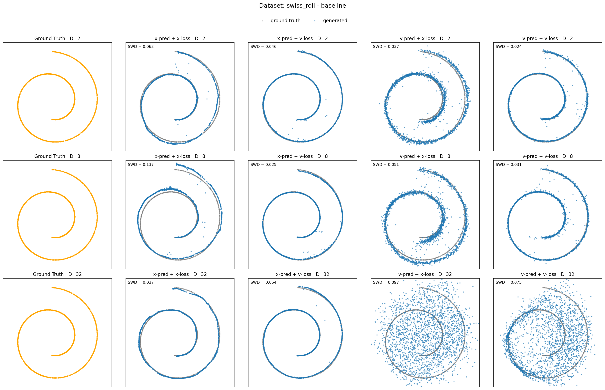

## Visualisations: what works and what doesn't
> **`opt001`: Noise dimension matched to data manifold.**

Relating to our hypothesis from part 2, [2] outlines a key insight, **the process should lie on the same manifold as the data**. From this the we have our first proposition **reduce the intrinic dimenionality of noise to match data, independent of $D$**.

To achieve this, it is natural to use the randomly initalised matrix $P$, responsible for projecting $R^D \rightarrow R^2$. We outline the process as follows,

1. Sample $\epsilon_2 \sim \mathcal{N}(0,I)$, where $\epsilon_2 \in R^2$
2. Project to $R^D$: $\epsilon_D = \epsilon_2 \cdot P$, where $\epsilon_D \in R^D$ and $P \in R^{2 \times D}$

The same procedure must be applied at sampling time, since the model has only ever seen noise on the data subspace. Concretely, the initial state of the ODE is drawn as $z_1 = \epsilon_2 \cdot P$ rather than $z_1 \sim \mathcal{N}(0, I_D)$, sampling from full-rank Gaussian noise in $\mathbb{R}^D$ would push the trajectory off the data manifold and break the train/test consistency that this rescue depends on. Below are results using this noise dim optimisation:

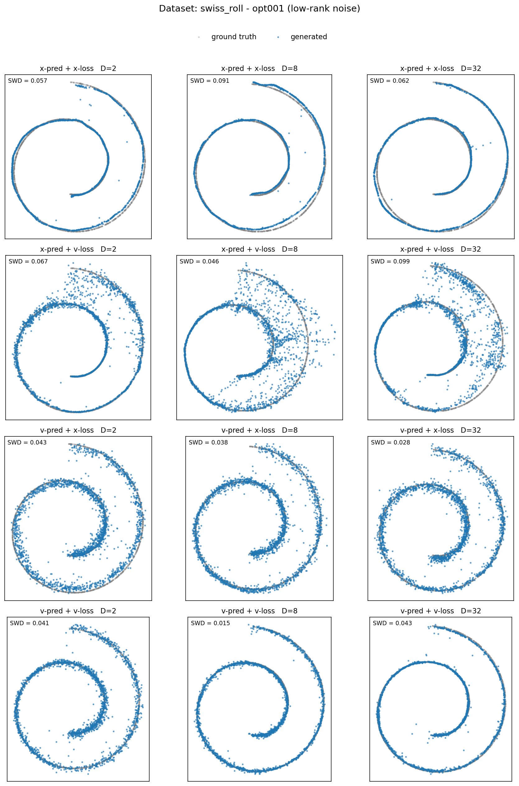

> **`opt002`: Width scaling on top of `opt001`.** 

The effect on $v$-pred at $D = 32$ is dramatic, samples recover recognisable swiss-roll structure where the baseline produced a diffuse blob. $x$-pred is essentially unchanged.

Section 4 of [3] argues wider networks specifically help $v$-prediction. We re-ran with $h = 512$ and $h = 1024$:

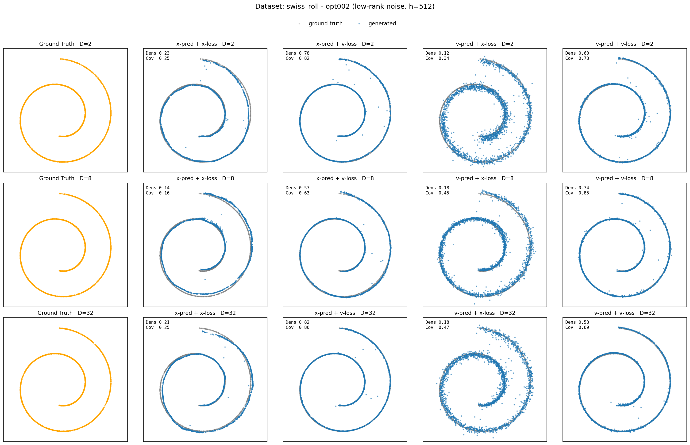

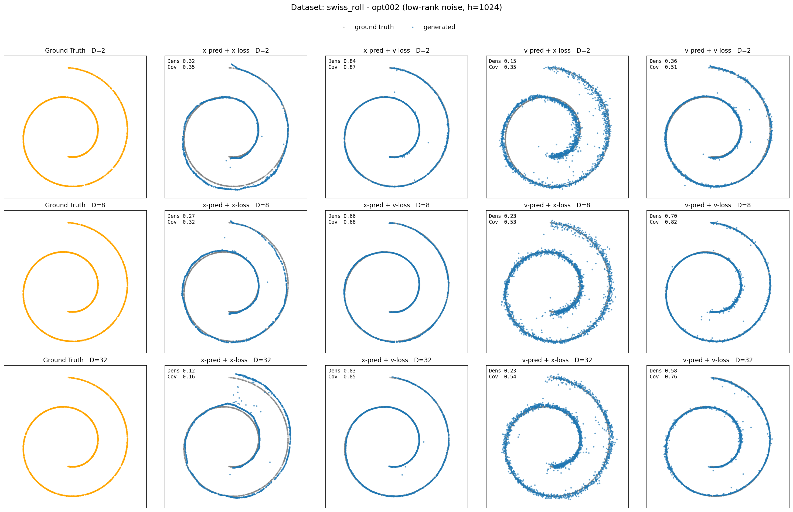

Width gives an additional but smaller bump, $v$-pred at $D = 32$ tracks the ground-truth shape a bit more tightly, though $h = 512$ vs $h = 1024$ is hard to separate qualitatively. The big win is `opt001`; `opt002` is incremental.

**Summary of what works/doesn't:** matching the noise process to the data manifold (`opt001`) is the decisive intervention and rescues $v$-pred at $D = 32$ at zero additional parameter cost. Width scaling helps further but with steeply diminishing returns. $x$-pred is unaffected by either change because it was already working, its target is intrinsically 2D regardless of $D$.

## Q1. Is v-prediction's failure fundamental?

No, the failure is parameterisation-dependent, not fundamental. Once the noise process is restricted to the same 2D subspace as the data, $v$-pred at $D = 32$ produces samples comparable in shape to $x$-pred (visually obvious in the `opt001` grid above; quantitatively the v-loss with v-pred drops from $0.0716$ at baseline to $0.0587$ with `opt001`, despite identical architecture and parameter count, see [Table 1] in appendix for more detail).

This **supports** the Part 2 analysis rather than contradicting it. In Part 2 we attributed the scaling gap to $v$'s dependence on full-rank noise: $v = \epsilon - x$ has intrinsic rank that grows with $D$, while $x$ stays on a 2D manifold. The rescue here works *exactly* by removing that asymmetry, projecting $\epsilon$ onto the data manifold so $v$'s intrinsic dimensionality also stays at $2$. The fact that this single change closes most of the gap is direct evidence that full-rank noise was the root cause we identified in Part 2, not some inherent property of the $v$ parameterisation.

## Q2. Approaches tried and compute cost vs. default x-prediction

Two interventions, applied cumulatively:
1. **Manifold-aligned noise (`opt001`)**: sample $\epsilon \in \mathbb{R}^2$ and project to $\mathbb{R}^D$ via the same $P$ used for the data, at both training and sampling time. No architectural change.
2. **Width scaling (`opt002`)**, increase hidden size from $h = 256$ to $h \in \{512, 1024\}$ on top of `opt001`.

| config                        | params    | rel. params | time/run | final loss (v-loss) |
|-------------------------------|-----------|-------------|----------|---------------------|
| **default x-pred** (baseline) | 312,608   | 1.0×        | 48s      | 0.0165 (x-loss)     |
| baseline v-pred               | 312,608   | 1.0×        | 46s      | 0.0716              |
| `opt001` v-pred               | 312,608   | **1.0×**    | 47s      | 0.0587              |
| `opt002_h512` v-pred          | 1,149,472 | 3.7×        | 48s      | 0.0589              |
| `opt002_h1024` v-pred         | 4,396,064 | 14.1×       | 75s      | 0.0588              |

An intresting observation is that `opt001`'s increased performance comes at no increased compute cost. 

Quanitfying performance via loss (especially when $x$-pred calculated using a different loss althougher) is uninformative. When analysing the density/coverage graph (see appendix table), we see `opt001` $v$-pred lands close to default $x$-pred, and `opt002` only marginally further.

So to match default $x$-pred sample quality at $D = 32$, $v$-pred needs `opt001` at minimum (free) and benefits modestly from `opt002_h512` (3.7× params for a small additional gain). $x$-pred remains the cheaper route in absolute terms, but the gap is far smaller than Part 2 suggested it would be.

## Q3. How do x-pred and v-pred respond to these changes?

They respond very differently. The figure below plots density/coverage averaged over $D$, with the optimisation stage on the x-axis, one panel per (pred, loss) combination:

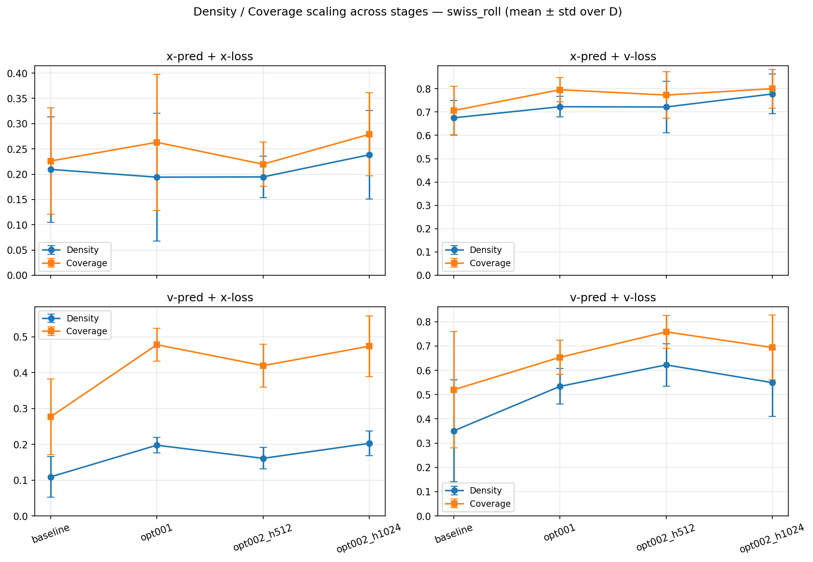

$x$-pred (top row) is approximately flat across `baseline -> opt001 -> opt002_h512 -> opt002_h1024`, both density and coverage barely move. $v$-pred (bottom row) shows a large `baseline -> opt001` jump, then near-flat `opt001 -> opt002` behaviour. The two parameterisations have completely different sensitivity profiles to the same set of changes.

The reason follows from what each parameterization has to learn as a function of $D$:

- **$x$-pred's target is intrinsically 2D regardless of $D$.** The clean data lies on the 2D manifold $\{x P : x \in \mathbb{R}^2\} \subset \mathbb{R}^D$, and that's true at $D = 2$ and at $D = 32$. So $x$-pred is already aligned with the manifold by construction, projecting noise onto the manifold doesn't change what's being learned, and adding width doesn't help fit a target that was already simple. There's nothing for these changes to fix.
- **$v$-pred's target inherits the dimensionality of $\epsilon$.** With full-rank Gaussian noise in $\mathbb{R}^D$, $v = \epsilon - x$ has intrinsic dimensionality $D$, so the model is fitting a $D$-dimensional regression target even though the data is 2D. `opt001` directly attacks this — projecting $\epsilon$ onto the manifold collapses $v$'s intrinsic rank back to $2$, restoring symmetry with $x$-pred. That's why the baseline opt001 jump is large. Once the target is again 2D, extra width (`opt002`) is fitting an already-tractable signal, so its marginal benefit is small, exactly the same regime $x$-pred has been in all along.

In short, $x$-pred and $v$-pred converge to the same response curve once the noise dimensionality is fixed. The asymmetry observed in Part 2 wasn't a property of the parameterisations themselves, it was a consequence of the noise process being mismatched with the data manifold for $v$ but not for $x$.

## Q4. Why does v-prediction behave differently in real image gen systems like FLUX and SD3

---

- seperate ground truth to left
- add loss curves to part 2) and part 3)
- add increased hidden layer to part 3)

- final part steps y, 

# References
[1] Naeem et al., "Reliable Fidelity and Diversity Metrics for Generative Models", ICML 2020 (arXiv:2002.09797).

[2] Li et al. "Back to Basics: Let Denoising Generative Models Denoise", 2026 (arXiv:2511.13720v2)

[3] Zheng et al. "Diffusion Transformers with Representational Autoencoders", 2025 (arXiv:2510.11690v1)

# Appendix

| stage | h | D | pred | loss | params | size | time | final loss |
|---|---|---|---|---|---|---|---|---|
| baseline | 256 | 2 | x | x | 297218 | 1.19 MB | 0m 47s | 0.2632 |
| baseline | 256 | 2 | x | v | 297218 | 1.19 MB | 0m 45s | 0.9808 |
| baseline | 256 | 2 | v | x | 297218 | 1.19 MB | 0m 48s | 0.2637 |
| baseline | 256 | 2 | v | v | 297218 | 1.19 MB | 0m 46s | 0.9451 |
| baseline | 256 | 8 | x | x | 300296 | 1.21 MB | 0m 49s | 0.0658 |
| baseline | 256 | 8 | x | v | 300296 | 1.21 MB | 0m 45s | 0.2475 |
| baseline | 256 | 8 | v | x | 300296 | 1.21 MB | 0m 47s | 0.0666 |
| baseline | 256 | 8 | v | v | 300296 | 1.21 MB | 0m 46s | 0.2385 |
| baseline | 256 | 32 | x | x | 312608 | 1.26 MB | 0m 48s | 0.0165 |
| baseline | 256 | 32 | x | v | 312608 | 1.26 MB | 0m 45s | 0.0607 |
| baseline | 256 | 32 | v | x | 312608 | 1.26 MB | 0m 49s | 0.0185 |
| baseline | 256 | 32 | v | v | 312608 | 1.26 MB | 0m 46s | 0.0716 |
| opt001 | 256 | 2 | x | x | 297218 | 1.19 MB | 0m 45s | 0.2629 |
| opt001 | 256 | 2 | x | v | 297218 | 1.19 MB | 0m 47s | 0.9768 |
| opt001 | 256 | 2 | v | x | 297218 | 1.19 MB | 0m 47s | 0.2637 |
| opt001 | 256 | 2 | v | v | 297218 | 1.19 MB | 0m 46s | 0.9451 |
| opt001 | 256 | 8 | x | x | 300296 | 1.21 MB | 0m 46s | 0.0658 |
| opt001 | 256 | 8 | x | v | 300296 | 1.21 MB | 0m 47s | 0.2438 |
| opt001 | 256 | 8 | v | x | 300296 | 1.21 MB | 0m 47s | 0.0659 |
| opt001 | 256 | 8 | v | v | 300296 | 1.21 MB | 0m 46s | 0.2357 |
| opt001 | 256 | 32 | x | x | 312608 | 1.26 MB | 0m 47s | 0.0165 |
| opt001 | 256 | 32 | x | v | 312608 | 1.26 MB | 0m 49s | 0.0607 |
| opt001 | 256 | 32 | v | x | 312608 | 1.26 MB | 0m 48s | 0.0165 |
| opt001 | 256 | 32 | v | v | 312608 | 1.26 MB | 0m 47s | 0.0587 |
| opt002_h512 | 512 | 2 | x | x | 1118722 | 4.48 MB | 0m 47s | 0.2631 |
| opt002_h512 | 512 | 2 | x | v | 1118722 | 4.48 MB | 0m 47s | 0.9883 |
| opt002_h512 | 512 | 2 | v | x | 1118722 | 4.48 MB | 0m 47s | 0.2633 |
| opt002_h512 | 512 | 2 | v | v | 1118722 | 4.48 MB | 0m 46s | 0.9444 |
| opt002_h512 | 512 | 8 | x | x | 1124872 | 4.50 MB | 0m 46s | 0.0657 |
| opt002_h512 | 512 | 8 | x | v | 1124872 | 4.50 MB | 0m 47s | 0.2419 |
| opt002_h512 | 512 | 8 | v | x | 1124872 | 4.50 MB | 0m 47s | 0.0659 |
| opt002_h512 | 512 | 8 | v | v | 1124872 | 4.50 MB | 0m 46s | 0.2349 |
| opt002_h512 | 512 | 32 | x | x | 1149472 | 4.60 MB | 0m 48s | 0.0165 |
| opt002_h512 | 512 | 32 | x | v | 1149472 | 4.60 MB | 0m 49s | 0.0605 |
| opt002_h512 | 512 | 32 | v | x | 1149472 | 4.60 MB | 0m 49s | 0.0165 |
| opt002_h512 | 512 | 32 | v | v | 1149472 | 4.60 MB | 0m 48s | 0.0589 |
| opt002_h1024 | 1024 | 2 | x | x | 4334594 | 17.34 MB | 1m 13s | 0.2635 |
| opt002_h1024 | 1024 | 2 | x | v | 4334594 | 17.34 MB | 1m 13s | 0.9721 |
| opt002_h1024 | 1024 | 2 | v | x | 4334594 | 17.34 MB | 1m 14s | 0.2636 |
| opt002_h1024 | 1024 | 2 | v | v | 4334594 | 17.34 MB | 1m 13s | 0.9446 |
| opt002_h1024 | 1024 | 8 | x | x | 4346888 | 17.39 MB | 1m 13s | 0.0658 |
| opt002_h1024 | 1024 | 8 | x | v | 4346888 | 17.39 MB | 1m 13s | 0.2444 |
| opt002_h1024 | 1024 | 8 | v | x | 4346888 | 17.39 MB | 1m 13s | 0.0659 |
| opt002_h1024 | 1024 | 8 | v | v | 4346888 | 17.39 MB | 1m 13s | 0.2357 |
| opt002_h1024 | 1024 | 32 | x | x | 4396064 | 17.59 MB | 1m 15s | 0.0165 |
| opt002_h1024 | 1024 | 32 | x | v | 4396064 | 17.59 MB | 1m 15s | 0.0612 |
| opt002_h1024 | 1024 | 32 | v | x | 4396064 | 17.59 MB | 1m 15s | 0.0165 |
| opt002_h1024 | 1024 | 32 | v | v | 4396064 | 17.59 MB | 1m 15s | 0.0588 |