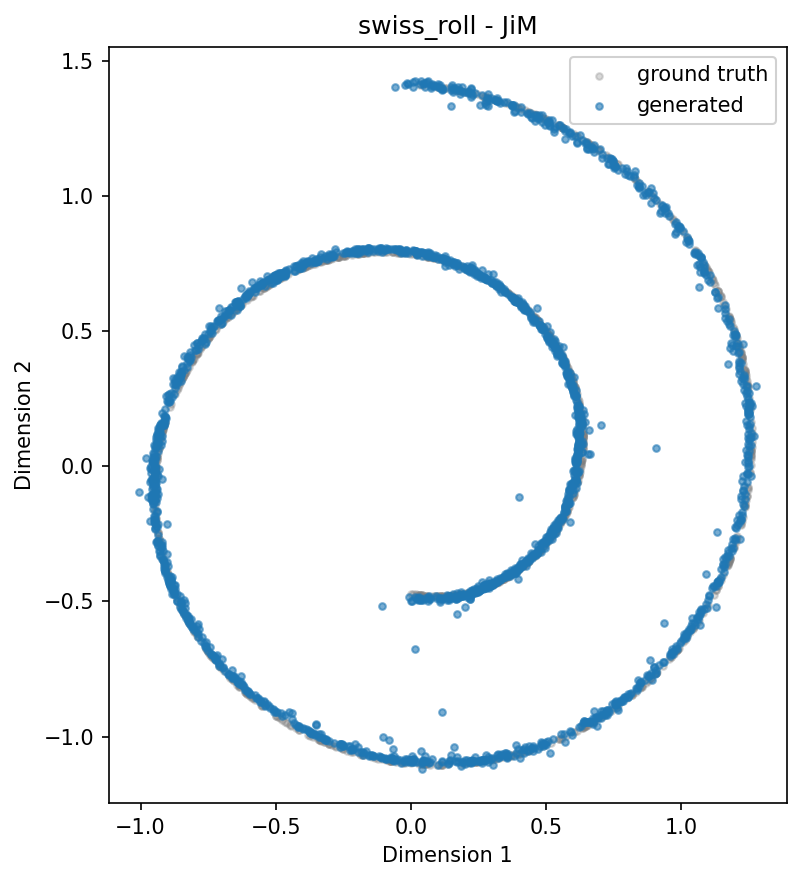
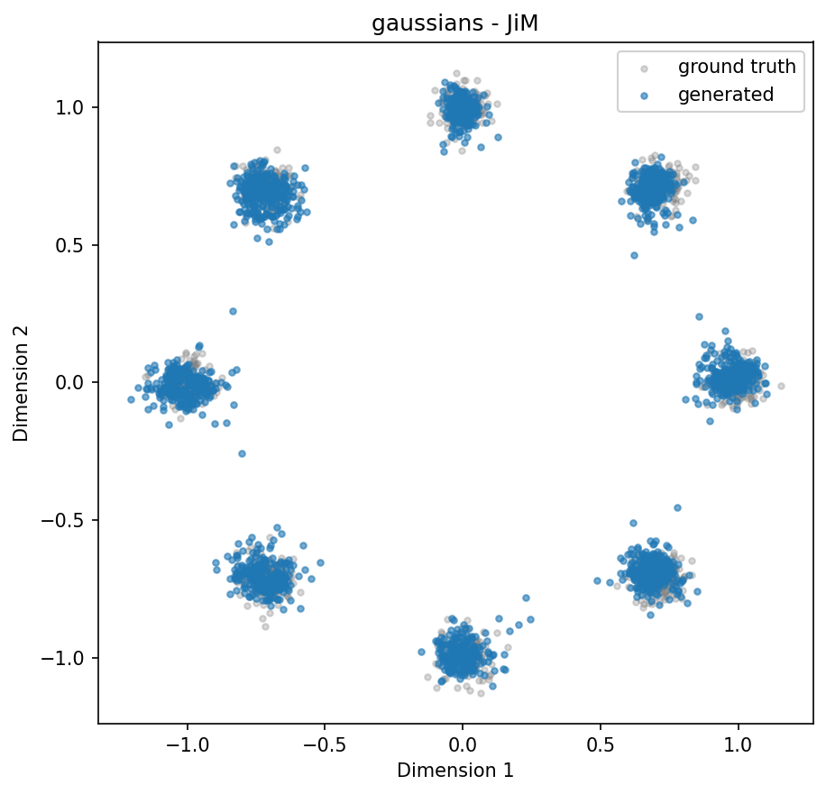
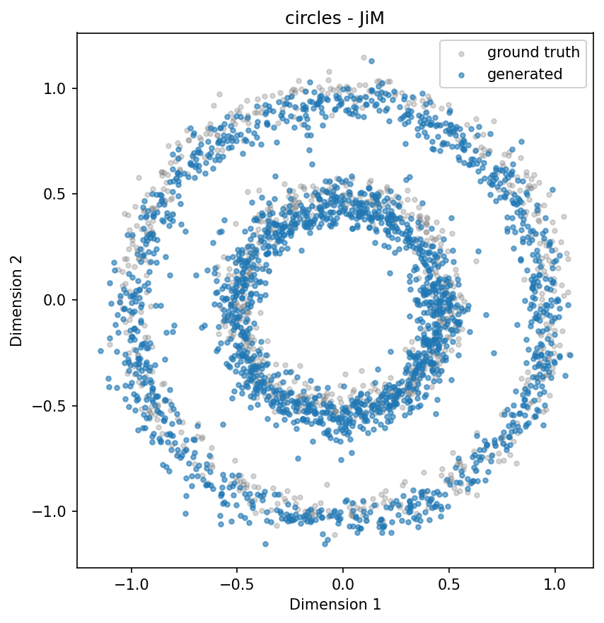
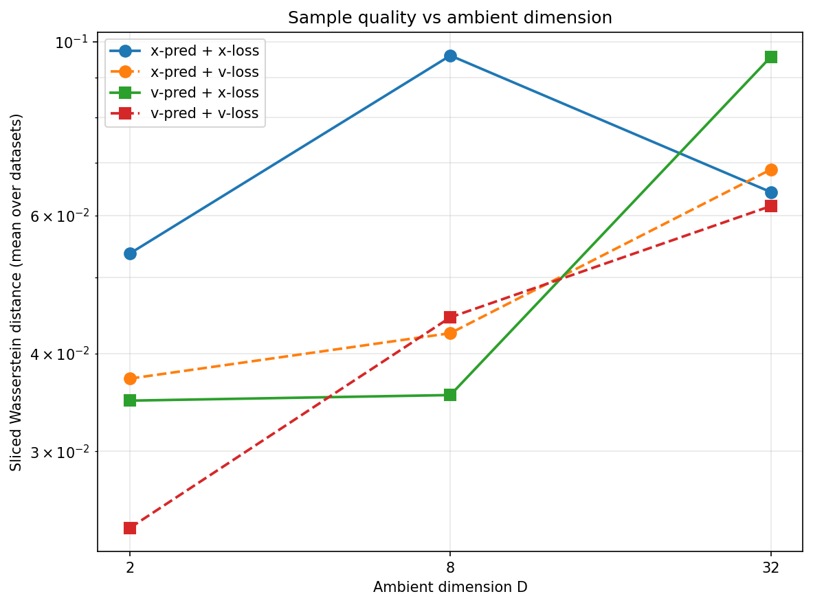
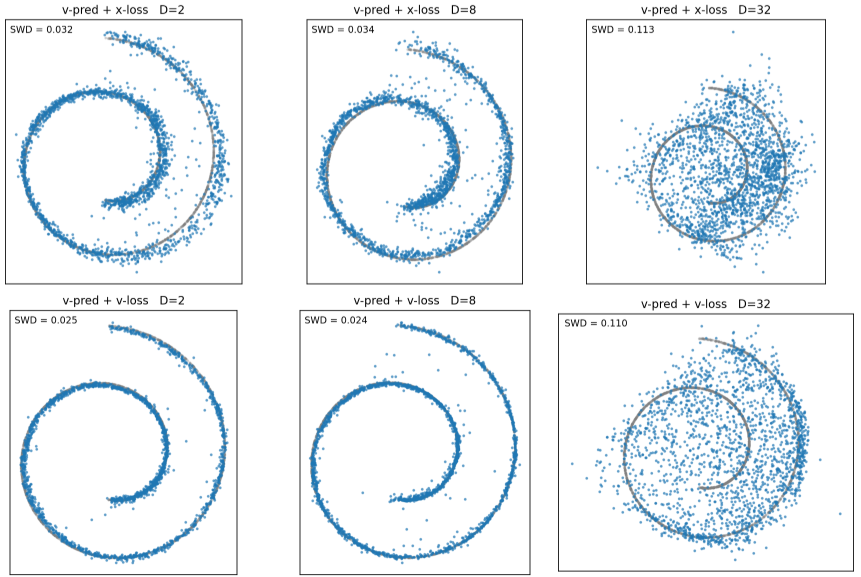

# Part 1

### Data Visualisation

### v-Prediction Flow Matching at `D = 2`

Hyperparameters:

| n_steps | lr | batch_size | denoising_steps | generated_points |
| - | - | - | - | - |
| 25000 | 1e-3 | 1024 | 50 | 2048 |

# Part 2

### Calculate flow matching based on $x$ or $v$-pred

We know (1) $z_t = (1-t)x + t\epsilon$. Further it is also defined that (2) $v = \epsilon - x$.

Rearranging (2) we get $\epsilon = v + x$, substituing this back into (1),

$$
z_t = (1-t)x + t(v + x) 
$$

$$
z_t = x - tx + tv + tx
$$

$$
z_t = x + tv \Rightarrow \boxed{x = z_t - tv} \Rightarrow \boxed{v = \frac{z_t - x}{t}}
$$

Hence in the scenario we predict $x$ with a loss in $v$, we can use the above equation to determine:

$$
v_\text{output} = \frac{z_t - x_\text{pred}}{t} \quad\quad\quad\quad v_\text{target} = \epsilon - x
$$

Similarly, for predicting $v$ with a loss in $x$, we have:

$$
x_\text{output} = z_t - t v_\text{pred} \quad\quad\quad\quad x_\text{target} = x
$$

### Reproduce papers findings

We use the same hyperparameters as Part 1.2.

### Questions

#### 1. Prediction-type scaling

It is clear that $x$-prediction scales to $D=32$ better than $v$-predictionm across the three 
datasets. Qualitatively $D=32$ with $x$-pred least resembles the target dataset. To make our analysis
more robust, we measure sliced Wasserstein distance to compare the ground truth vs sampled generation.
We identify the trend, for each prediciton type, we average the WSD for each $D$, the results are below:

The above the trend is clear, $v$-pred scales the worst, while $x$-pred scales successfully, i.e., 

$$x_\text{pred} >_\text{dim scaling} v_\text{pred}$$

It is at $D=32$ where the latter 3 prediction types **fail**.

#### 2. Loss-space
The loss space appears to have a minimal impact. Referring to the above graph, consider the green and red lines (i.e., $v$-pred with each kind of loss). Both follow almost identical SWD trends across the $D$ dimension, similar can be said for respsective blue and orange curves.

It is clear that prediction type has signficiantly more impact than loss-type, in generation quality.

#### 3. Why does $x$-pred scale to higher $D$
$x$-prediction scales superior to $v$-prediction as $D$ grows, as the signal to be learned is better preserved. For $x$-pred at a high $D$, the target data lies on a 2D manifold under $R^D$ (well described in [Basics](papers/Basics.pdf)). Therefore the model is intrinsically learning in 2D, regardless of $D$, i.e., a projection onto the manifold. I.e., $rank(x)_\text{intrinsic} = 2$.

Meanwhile, for $v$-prediction, the model is tasked with learning $v=\epsilon-x$. Unlike $x$, $\epsilon$ is full-rank Guassian noise in $R^D$ (i.e., intrinsic dim = $D$). This implies $v$ measurments are dominated by $\epsilon$, meaning $\uparrow D$ results in linearly increased complexity in $v$, while $x$'s complexity remains at 2. From inductive bias, it follows that the model will struggle to fit the taret. 

As for the loss-space, the MSE is a $t$-dependent reweighting, meaning the underlying objective being learned remains the same.

# Part 3: Can We Rescue v-Prediction?
### Baseline
From part 2, we have the following baseline for $v$-prediction (SWD ~ 0.11):

We previously determined that $v$-pred struggles as $D$ scales, due to full-rank gaussian noise impeding the intrisically 2-dimentional target signal. The [RAE](papers/RAE.pdf) outlines the key insight, **the process should lie on the same manifold as the data**. From this the we have our first proposition **reduce the intrinic dimenionality of noise to match data, independent of $D$**.

To achieve this, it is natural to use the randomly initalised matrix $P$, responsible for projecting $R^D \rightarrow R^2$. We outline the process as follows,

1. Sample $\epsilon_2 \sim \mathcal{N}(0,I)$, where $\epsilon_2 \in R^2$
2. Project to $R^D$: $\epsilon_D = \epsilon_2 \cdot P$, where $\epsilon_D \in R^D$ and $P \in R^{2 \times D}$

The same procedure must be applied at sampling time, since the model has only ever seen noise on the data subspace. Concretely, the initial state of the ODE is drawn as $z_1 = \epsilon_2 \cdot P$ rather than $z_1 \sim \mathcal{N}(0, I_D)$, sampling from full-rank Gaussian noise in $\mathbb{R}^D$ would push the trajectory off the data manifold and break the train/test consistency that this rescue depends on. Below is 